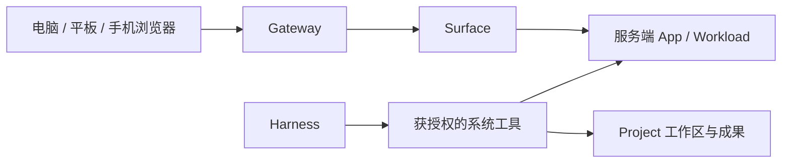

# Agent WorkOS V2：中期架构修订

- 日期：2026-09-15（UTC）
- 代码基线：`main@f2ab5d4`
- 文档状态：保留 2026-09-15 中期设计；2026-09-22 已按确认范围交付，见 [实现收口](architecture/v2-delivery-status.md)
- 原方案：[完整架构 v0.2](structure.md)
- 当前事实：[实现说明](architecture/implementation.md)、[进度记录](status.json)
- 本次任务：[V2 中期架构修订](tasks/20260915-architecture-v2-midterm-review.md)

本文记录当前实现与产品目标之间的差距，明确下一阶段做什么、复用什么，以及如何验收。
V2 是设计文档版本，不代表全部 RPC 升级为 v2，也不表示下述能力已经实现。
现行实现仍遵循已接受 ADR；涉及其边界或行为的调整，须在后续功能任务中通过专项 ADR 采纳。

2026-09-22 更新：下文差距、建议与优先级保留原设计时点。后续 ADR-0032 至 ADR-0036
及专项任务已实施确认范围；[交付与证据索引](architecture/v2-delivery-status.md)列出最终行为、
已验证环境和明确未验收边界，不把 Docker 网络或 Android 模拟器称为物理设备/公网。

2026-09-22 日常使用增量：本项目本身采用浏览器优先的共享逻辑桌面，见
[ADR-0037](decisions/0037-shared-desktop-daily-continuity.md) 与
[实施任务](tasks/20260922-shared-desktop.md)。目标为电脑、手机、平板共享项目、窗口、
焦点及会话选择，显式启动的程序持续运行到主动停止；局域网／既有组网访问，
不增加公网部署。自动化与真机试用分别记录，仍未宣称物理 Safari／Android 已验收。

## 1. 产品定位与固定前提

**WorkOS 是基于 Harness 的个人工作环境：Agent 持续推进目标，用户通过浏览器直接使用应用、
查看成果并接管工作。**

V2 围绕两条主线推进：

- **Agent 持续工作**：用户给定目标和授权，Harness 负责规划、执行与继续工作。
- **Work anywhere**：应用运行在服务端，用户从不同设备进入同一个项目并继续操作。

近期先完成局域网内的浏览器访问与设备接续；后续扩展到跨网络直接访问。当前复用已有配对、
认证和授权，不增加公网部署专项。

### 1.1 已确定的产品选择

- 基于标准 Linux 用户空间，单 owner、单主机优先。
- DeepSeek Harness 优先深度接入，保留 Provider 可替换性。
- 软件开发与维护作为首个完整验收场景；长期覆盖研究、个人应用及其他项目工作。
- 用户主要向 Agent 表达目标，工作台承接过程与成果，用户可以直接操作应用和接管工作。
- 自主执行围绕用户明确给出的目标；主动发现新目标留到后续阶段。
- 保留 Project Spaces、完整桌面画布、窗口与 Dock，Agent 不使用永久侧栏。

### 1.2 与原方案的主要调整

| 原方案部分                            | 保留                                     | V2 调整                                                         |
| ------------------------------------- | ---------------------------------------- | --------------------------------------------------------------- |
| §4–7 Project / Harness / Agent API    | 全局 Harness、项目可选绑定、统一能力接口 | 优先接入原生持续会话与工具，补齐 Harness 调用 WorkOS 能力的方向 |
| §8–10 Runtime / Reliability / Surface | App、Workload、成果、监督和发布回滚      | 分离程序运行与设备访问，绑定构建产物和实际运行版本              |
| §11–12 Desktop / Mobile               | 统一工作台、多尺寸界面、应用窗口         | 围绕持续会话、实际应用操作与跨设备接续组织入口                  |
| §13 LAN / Transport                   | 统一 Gateway、LAN 起步、远程扩展点       | 局域网多设备成为近期产品验收，跨网络浏览器直达作为后续目标      |
| §14–18 部署 / 存储 / 协议 / 路线      | 六进程、数据所有权与契约纪律             | 按完整用户链路安排投入，逐项区分实现与环境验证                  |

**中期结论：已有平台基础继续复用，下一阶段集中补齐真实 Harness 持续操作项目，以及用户
在 Web 中直接使用应用的链路。**

## 2. 当前实现检查

以下判断来自代码、Proto、已有测试和仓库验收记录。中期能力判断未重新执行真实模型、
跨设备或跨进程产品验收；本次文档变更执行的检查另见任务记录。

| 领域         | 当前已有基础                                       | 主要缺口或证据边界                                                                                 |
| ------------ | -------------------------------------------------- | -------------------------------------------------------------------------------------------------- |
| 项目与应用   | Project、注册、安装、权限、版本历史                | 尚未形成供人和 Harness 共同使用的完整开发环境                                                      |
| Harness      | 单次任务、持久事件、取消、凭据租约和部分结构化成果 | 持续会话、追加指令、原生工具和目标能力尚未充分接入；Provider 的 fixture 证据不等于真实外部服务验收 |
| 工作区与知识 | 文件 Bridge、工作区索引、离线语义检索              | 文件索引、终端、应用文件访问和 Harness 尚未形成一致的工作区视图；检索也不等于 Harness 会话记忆     |
| 桌面工作台   | 窗口、项目切换、通知、审批、成果审阅               | Agent Center 主要是任务表单；Code/Docs 等入口尚不能代表完整开发工具                                |
| Web 应用使用 | Web Bundle、部分服务与远程图形链路                 | 应用运行与客户端连接的生命周期尚未充分分离                                                         |
| 构建与发布   | 真实构建测试命令、候选版本、发布与回滚状态机       | 缺少构建产物与实际运行版本的完整绑定                                                               |
| 运行与监督   | 浏览器、PTY、Native 的部分真实运行证据             | rootless 隔离尚无目标宿主验收；Native/WebRTC 证据限于回环拓扑                                      |
| 设备与通知   | Web 配对、通知同步、LAN 发现                       | 移动原生二进制、真机存储、设备 HTTP 和推送仍有验证缺口                                             |

### 2.1 Harness：当前适配范围不代表完整原生能力

[DeepSeek 当前配置](../deploy/harness/deepseek.cordis.yml)明确关闭工作区、Skills、Bash、
后台任务和目标能力；[运行适配器](../internal/harness/adapters/deepseek/runtime.go)为每个任务
创建临时目录和独立子进程，执行结束后清理。公开
[Agent Task 协议](../api/proto/workos/agent/v1/agent.proto)主要提供提交、读取、列表、取消与事件订阅。

DeepSeek 上游架构已列出会话持久化、目标、工具、后台任务和子 Agent 等扩展点。下一步首先
核对这些能力与仓库锁定的 `0.1.1rc1` 运行时的差异，再通过官方 SDK、Profile 和插件接入。
上游当前文档不能作为已锁定运行时或现有 Adapter 支持这些能力的证明。
参考：[DeepSeek 架构](https://github.com/deepseek-ai/deepseek-harness/blob/master/docs/architecture.md)、
[SDK Profile](https://github.com/deepseek-ai/deepseek-harness/blob/master/packages/bundle/sdk-app/README.md)
（查阅于 2026-09-15）。

### 2.2 发布：需要证明运行服务使用了新产物

当前[构建器](../internal/runtime/buildtest/adapters/processexec/engine.go)执行真实命令，但结束后
删除临时构建目录；[构建结果协议](../api/proto/workos/taskexecution/v1/build.proto)返回执行状态、
退出码、引擎事实和源码摘要，没有持久化可部署产物引用。

[候选 manifest 生成](../internal/core/appregistry/application/staging.go)修改版本及源码绑定，
保留原 `runtime.image`。[现有组合测试](../tests/integration/repair_buildtest_test.go)验证了构建、
版本流转、Surface 创建和台账收敛，但不足以证明运行中的服务加载了此次构建的新代码。

V2 将“构建产物 → 精确版本 → 实际运行行为”列为独立交付任务。已有流程和失败处理继续复用，
不能将其现有证据扩大为真实应用修复已完成。

### 2.3 Surface：当前生命周期影响接续使用

[ADR-0029](decisions/0029-virtual-display-native-runner.md)中的 Native 实现，在窗口关闭或
项目切换时回收会话；媒体路径仅允许回环地址。同一客户端内响应式布局保持会话的证据，
尚不能证明独立设备之间的持续使用。

V2 需要调整持续应用的生命周期，并补充真实局域网媒体与输入链路。Surface 重连后是否仍是
原程序实例，必须通过 Workload 身份和实际应用状态验证。

## 3. V2 核心结构

### 3.1 保留六个进程边界

| 进程               | V2 职责                                                      |
| ------------------ | ------------------------------------------------------------ |
| `gateway`          | 用户与设备入口、认证、公开 API、事件和 Surface 访问          |
| `core`             | Project、授权、应用与成果事实、任务登记和跨模块协调          |
| `harness-host`     | Harness Adapter、实例与原生会话接入、执行控制和能力声明      |
| `runtime-host`     | 工作区与执行环境、应用运行、构建产物、浏览器、终端和 Surface |
| `reliability-host` | 确定性监督、Incident、恢复与发布回滚编排                     |
| `indexer`          | 工作区和成果的派生索引、检索与归档                           |

Core 保存归属与授权事实，Runtime 负责工作区的实际装配和运行事实。跨进程通过版本化 RPC
和事件协作，不共享内部表或可变实体。Provider 类型留在对应 Adapter。

### 3.2 Harness 与 WorkOS 分工

| Harness 负责                     | WorkOS 负责                              |
| -------------------------------- | ---------------------------------------- |
| 推理循环、工具选择与任务内规划   | 项目、工作区和应用归属                   |
| 原生会话、上下文压缩与目标续跑   | 会话关联、进度展示和跨设备访问           |
| 原生工具、Skills 与子 Agent 协作 | 系统能力授权、凭据、预算和运行资源       |
| 理解问题、修改代码与生成成果     | 构建产物、应用版本、发布和确定性故障保护 |

WorkOS 优先复用 Harness 已有能力，不新增自研 Agent Loop、上下文压缩器或通用多 Agent
调度框架。Harness 能力不足时明确记录限制，通过适配或上游扩展解决。

原生审批接入统一界面，但 WorkOS 的授权、资源限制和故障保护仍由确定性系统执行。
App 只请求 capability，真实凭据由现有凭据体系管理。

### 3.3 以原生会话承接持续工作

```text
Project
├── Workspace：真实工作目录与执行环境
├── Harness Binding：Provider、Profile 与运行策略
│   └── Harness Session：映射原生会话
│       ├── 用户指令与讨论
│       ├── Harness 原生目标与执行状态
│       └── 多次执行、工具活动与成果引用
├── Apps：持续运行的软件
└── Artifacts：可审阅、可引用的成果
```

- 保留全局 Harness 与项目可选绑定；不同项目使用隔离的会话和权限。
- 原生会话和上下文由 Harness 管理；WorkOS 保存引用、授权、审计和展示所需的投影。
- 现有 Task 继续承担执行记录和外部委托入口，补充与会话的关联。
- 一次执行结束后，会话仍可继续；长期目标采用 Harness 明确提供的语义，不以输出一条
  完成事件代替目标达成。
- 恢复会话与重新执行命令分别处理。崩溃后结果不明的外部操作需要核对，不能盲目重放。
- 更换 Provider 时建立新会话并显式交接资料，不承诺原生上下文无损迁移。

### 3.4 吸收 Kasm 的 Web 应用交付理念

本阶段吸收的范围是：**软件在服务端运行，用户通过浏览器直接操作，并能从另一台设备重新
进入。** Kasm 支持通过工作区提供桌面或单个应用，其中应用通过 Web 交付的思路适合纳入
WorkOS。参考：[Kasm 工作区](https://kasm.com/docs/latest/guide/workspaces.html)
（查阅于 2026-09-15）。

沿用已有对象表达这条链路，不为借鉴该理念新增独立工作环境服务：

| 对象            | 含义                                   |
| --------------- | -------------------------------------- |
| Project         | 工作上下文，关联文件、Agent 会话和应用 |
| App             | 用户使用的软件及其版本、能力和配置     |
| Workload        | 服务端实际运行的程序                   |
| Surface         | 用户在某台设备上的访问界面             |
| Harness Session | 持续讨论与 Agent 执行的原生会话        |



Web 应用通过托管或代理展示，原生图形应用通过远程图形 Surface 展示，终端通过终端
Surface 展示。用户在正常 WorkOS 窗口中操作应用，无需进入另一个管理后台。

Kasm Workspaces 与 KasmVNC 保留为后续候选实现，通过既有 Runtime／Surface 扩展点接入。
前者提供平台级会话管理 API，后者提供浏览器图形访问能力；具体采用范围通过后续验证确定，
Surface 的长期契约不绑定单一 WebRTC 实现。参考：
[Kasm API](https://kasm.com/docs/latest/developers/developer_api.html)、
[KasmVNC](https://kasm.com/kasmvnc)（查阅于 2026-09-15）。

本阶段不引入完整桌面平台、镜像市场或多主机调度体系，也不立即安装或依赖 Kasm。

### 3.5 分离运行与访问生命周期

对于需要持续工作的应用：

- 关闭窗口、切换项目、网络中断，默认只解除当前 Surface 连接。
- 停止程序、重启程序和删除持久数据是独立操作。
- 再次进入时重新授权，并关联仍存活的 Workload。
- 程序因故障或资源策略停止时，界面明确显示实际状态；重启产生的新实例不能显示为
  原程序仍在运行。
- 文件持久化、程序运行状态和 Harness 会话恢复分别处理。
- 首期同一交互式应用只允许一个主动控制端，新设备通过明确接管切换。

普通 Web App 的页面状态能否恢复，由应用本身的持久化能力决定；WorkOS 不承诺任意页面
内存状态都能跨设备保存。持续应用仍受明确的资源和生命周期策略约束，不意味着无限保活。

### 3.6 工作区、系统能力与工作台

普通代码仓库直接成为 Project 工作区；需要由 WorkOS 安装和维护的软件进入 App 体系。

- Harness 的文件工具、命令执行和用户的开发界面指向同一受控工作区。
- 索引用于发现内容，真实文件与版本仍是工作事实源；共享知识检索与 Harness 原生记忆
  分别管理。
- 独立并发开发使用不同分支或 worktree，用户可查看并接管当前开发工作区。
- 当前小型不可变源码包继续服务于适用的交付场景，不扩充成整个开发环境的替代品。
- App 可以调用 Agent；Harness 也能通过授权工具操作项目、成果、应用和 Runtime。
- Agent、App 与用户分别授权，复用已有业务服务，避免建立第二套同义实现。
- Agent Center 支持持续对话、追加要求、询问、审批和成果关联；应用保持正常窗口，
  支持用户直接操作。移动端优先承接查看、追问、审批和适配后的应用操作。

### 3.7 绑定可部署产物与运行版本

```text
源码版本 → 构建与测试 → 持久化产物及摘要
→ 候选版本 → 实际运行验收 → 发布或回滚
```

Runtime 负责运行和产物事实，Core 负责版本绑定与授权，Reliability 复用现有监督、发布与
回滚编排。候选版本必须绑定此次验证的不可变产物，实际启动时核对该身份。
自动修复经过相同交付链路；失败构建不能产生可发布版本。

### 3.8 接口演进方向

后续按实际能力补充：

- Harness 会话的创建、继续、追加输入、询问与审批响应。
- Surface 的连接、断开、重新关联和控制权接管。
- 独立的 Workload 停止与重启操作。
- 与单一图形传输实现解耦的连接描述及能力声明。
- 构建结果中的持久产物引用，以及版本对该产物的绑定。

具体消息与字段由对应功能任务定义，先修改 Proto 再生成代码；v1 字段号不得复用，
破坏性变更使用新协议版本与 ADR。App manifest 继续以版本化 JSON Schema 为唯一事实源。
保留每表单一 owner、事件 at-least-once 与持久 cursor、UTC、UUIDv7、外部写幂等纪律。

## 4. 后续优先级与验收

### 4.1 路线

| 阶段                 | 重点                                                    | 验收结果                                                         |
| -------------------- | ------------------------------------------------------- | ---------------------------------------------------------------- |
| P0：核对接入基线     | DeepSeek 原生能力、锁定版本、项目执行环境与现有运行限制 | 区分上游支持、Adapter 已接入和部署可用；形成可复现版本与能力矩阵 |
| P1：持续开发会话     | 原生会话、真实工作区、文件和命令工具、桌面对话          | 完成真实代码修改与测试，客户端重连后继续同一会话                 |
| P2：Web 直接使用应用 | 应用启动、Surface 连接、断开与接管                      | 局域网两台独立设备操作同一应用；关闭界面不误停程序               |
| P3：真实交付与维护   | 构建产物、运行版本、发布和回滚绑定                      | 新版本呈现新行为，回滚恢复旧行为                                 |
| P4：跨网络与扩展     | 浏览器直接远程访问、候选图形后端、移动与更多 Harness    | 在真实不同网络完成接续，并逐项提供能力证据                       |

**P1 与 P2 构成下一阶段的主要产品交付。** 先完成契约与依赖，再实施对应链路；每项任务
只有一个 branch/worktree，不将所有后续工作重新合并为无边界的能力总攻。

下一项开发任务建议：在 P0 确认的运行时与执行环境上，让一个 DeepSeek 原生会话持续修改
项目代码、执行测试，并从 WorkOS 桌面恢复和继续。P2 同时需要解除当前 Native 的回环限制
和关闭窗口即回收程序的生命周期耦合；实现方式可复用已有后端或经验证的候选组件。

### 4.2 贯穿用户场景

1. 用户在电脑浏览器打开 Project，向 Agent 布置开发目标并讨论方案。
2. Harness 修改项目文件、执行测试，用户打开实际应用预览。
3. 用户关闭电脑上的工作窗口。
4. 在同一局域网的平板浏览器进入项目，继续操作应用并追问 Agent。
5. 发布时验证运行应用的实际行为与构建产物一致。
6. 后续在不同网络重复同一流程，完成跨网络验收。

### 4.3 关键测试与证据

- **持续会话**：追加要求、客户端刷新/断线、Harness 重启后的可恢复状态、预算耗尽与取消。
  对执行结果不明的操作明确提示核对，不能盲目重放有副作用命令。
- **设备接续**：两台独立设备真实连接同一服务端程序，验证 Workload 身份、已输入内容和
  后台工作；布局重挂载或同主机测试不能代替该证据。
- **控制与授权**：设备接管后旧控制端失效，重新进入时重新授权；覆盖项目切换、撤权和
  迟到响应，不改变既有安全边界。
- **真实交付**：修改前后服务行为不同，源码与产物摘要可追溯；构建失败零发布，回滚恢复
  旧行为，重启、重复请求和用户版本变更不导致误发布。
- **环境限制**：缺失能力明确 unavailable；进程级执行、容器隔离、真实模型服务、原生设备
  与网络拓扑的证据分别记录。
- **界面**：按 [UI 记录规范](ui/README.md)使用固定 viewport 和确定性 fixture 保存
  before/after/current。真实模型验收与无凭据的视觉采集分开，不能将模拟响应当作真实能力。

已有回归继续保留。后续功能任务完成 `make generate` 一致性与 `make check`，公共行为增加
对应单元/集成测试，跨进程用户链路提供 E2E 或明确测试任务。

## 5. 文档交付与默认边界

- 本文独立保存中期判断与修订路线，原结构方案保留作为对照。
- 近期优先 Desktop Web、局域网、本地 Git／目录工作区和单应用 Surface。
- Kasm 的具体组件与部署方式暂不锁定；后续优先验证复用方案。
- 跨网络直接浏览器访问保留为明确目标，当前不展开公网部署专项。
- 通知、知识、移动和 Native 的长期方向保留，新增投入按上述用户链路排序。
- 当前事实与未来设计分别表述，文档完成不提升任何功能状态。
- 后续实现通过专项 ADR 采纳调整，并同步协议、模块文档、测试、UI 证据与进度记录。

本次交付及执行过的检查以[任务记录](tasks/20260915-architecture-v2-midterm-review.md)为准。
