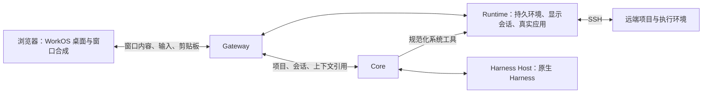

# Agent WorkOS V3：浏览器原生桌面与 Harness 共同工作

- 日期：2026-09-24（UTC）
- 代码基线：`main@39f584b`
- 文档状态：已确认产品范围与实施路线；V3 功能尚未实施
- 前一版本：[V2 结构方案](structure-v2.md)、[V2 交付与证据](architecture/v2-delivery-status.md)
- 当前事实：[实现说明](architecture/implementation.md)、[进度记录](status.json)
- 文档任务：[V3 架构交付](tasks/20260924-architecture-v3-native-workspace.md)

本文记录 V2 之后的产品方向、架构调整和验收门禁。设计目标不代表当前能力已经实现，
Greenfield 上游能力也不代表 WorkOS 已完成接入。现行实现仍遵循已接受 ADR；后续行为
变化通过专项任务与 ADR 采纳。V3 是产品设计版本，不意味着所有 RPC 升级为 v3。

## 1. 产品定位与已确定范围

**拥有一台电脑，就能从浏览器进入自己的完整工作环境；人和 AI 使用同一份项目、
同一个运行环境和同一批应用。**

浏览器是这台电脑的工作入口。真实文件、程序、开发环境和 Harness 在服务端持续存在，
用户通过完整桌面、窗口和 Dock 使用它们。AI 理解当前工作上下文，直接调用系统能力；
用户能看到实际变化、介入修改、接手应用，再让 AI 继续工作。

### 1.1 产品选择

- 以标准 Linux 用户空间、单 owner 和一台 WorkOS 主机为基础，逐步接入已有真实仓库。
- 浏览器是唯一客户端主线，不再新增 Mobile、Android 原生客户端工作；已有代码与
  V2 验收证据保留。不同屏幕使用同一浏览器桌面，不另建移动产品线。
- 只面向局域网，macOS Chrome／Edge 优先验收；不安排公网部署、穿透或新组网专项。
- 不新增登录、配对、授权或审批工作流，沿用现有机制与系统边界。
- 软件开发是首个完整场景，同时推进日常可用的电脑体验和人与 AI 共同操作。
- 默认在持久项目环境中使用真实工作目录；人和 AI 直接协作，并行任务使用独立工作树。
- 原生应用先覆盖 WorkOS 启动的 Linux 应用，不接管宿主机已经打开的整套桌面。
- WorkOS Code 使用真正的桌面版 VS Code。IDE 服务于人的查看、编辑、调试与接手；
  Harness 直接操作对应工作区和运行环境。
- 保留原生 Harness 的会话、目标、Skills 与子 Agent 能力，不新增自研 Agent Loop。

### 1.2 V3 要解决的系统局限

| 当前局限                                     | V3 的变化                                        | 用户得到的结果                         |
| -------------------------------------------- | ------------------------------------------------ | -------------------------------------- |
| 应用能显示，但窗口、输入与复制粘贴仍有割裂   | 浏览器窗口合成与统一输入、剪贴板                 | 使用真实应用时保持同一桌面的操作习惯   |
| AI 会操作文件，却不充分理解用户正在看的现场  | 项目上下文关联编辑位置、诊断、运行实例和应用状态 | 可以直接指出问题并共同处理             |
| 文件共用，但命令、终端与开发服务的环境仍分散 | 持久项目环境承接工具链、依赖和程序               | 编辑、测试、调试与实际运行使用一致环境 |
| IDE、SSH 与 Agent 容易作用于不同机器或目录   | 项目明确绑定执行目标，IDE 与 Harness 共用        | 在远端开发时也能与 AI 连续协作         |

## 2. V2 基础与当前事实

[V2 交付索引](architecture/v2-delivery-status.md)已记录持续 Harness 会话、真实工作区、
程序接续、原生目标与子 Agent，以及真实产物发布和回滚。共享逻辑桌面与主动停止策略
由 [ADR-0037](decisions/0037-shared-desktop-daily-continuity.md)进一步补齐。
这些交付继续复用，V2 中期文档里的历史差距不重新当作当前缺陷清单。

本次静态检查发现的 V3 起点：

- [Code 入口](../apps/desktop-web/src/SystemApps.tsx)主要展示补丁成果；
  [Files](../apps/desktop-web/src/WorkspaceFiles.tsx)已有带 etag 的文本编辑，尚不是完整 IDE。
- Browser 已有远程 Chromium 画面，但当前桌面界面没有接通页面点击和键盘输入。
- [工作区命令执行器](../internal/runtime/workspacehost/adapters/dockerexec/engine.go)使用
  临时禁网容器，工具链固定；持久依赖安装与完整日常开发环境需要后续实现。
- [Native 引擎](../internal/runtime/nativehost/adapters/xvfbengine/engine.go)当前使用
  Xvfb、VP8 编码与 WebRTC，**不是 VNC**。现有配置为 10 FPS、800 kbps，
  [尺寸上限](../internal/runtime/nativehost/domain/session.go)为 1920×1200。
  固定画面、有限输入事件和缺少剪贴板桥接限制了代码编辑与高分屏体验。
- [Harness 系统工具](../internal/core/orchestration/session_tools.go)已能操作文件、命令、
  预览和成果；统一的 IDE 编辑上下文、应用观察和人机输入交接仍待补齐。

以上来自代码、Proto 与既有测试的检查；本次文档任务没有重新执行真实模型、Mac 输入、
图形性能或 SSH 产品验收。现有 `working` 状态只覆盖已经记录的实现范围。

## 3. V3 核心结构

### 3.1 浏览器负责桌面合成

Native Surface 演进为窗口级接入。真实应用窗口、菜单、弹窗、光标与焦点融入 WorkOS
桌面，用户直接操作应用，不需要进入第二套桌面或连接管理界面。

| 层次    | 职责                                                                 |
| ------- | -------------------------------------------------------------------- |
| 浏览器  | 窗口排列、装饰、拖动、内容合成、光标、本地输入处理与剪贴板入口       |
| Runtime | 应用进程、显示会话、原生窗口身份与关系、应用内容、输入执行及重新附着 |
| Core    | 项目、应用引用与共享逻辑桌面；不保存图形缓冲区或设备传输凭据         |

窗口拖动与光标在浏览器本地响应，应用内容按窗口尺寸及设备像素比重新绘制。静态代码
与文字需要无损刷新路径；不能长期用缩放旧画面或低码率视频代替清楚的文字。
菜单和弹窗保持父子关系，焦点、层叠和关闭行为与 WorkOS 窗口一致。

**采用浏览器合成器路线，以 Greenfield 为首个验证实现。** 其浏览器合成库、窗口事件和
文本剪贴板接口提供可复用的基础。WorkOS 接入这些能力并维护自己的桌面交互，不引入
上游演示 Shell 的第二套桌面。参考：
[设计说明](https://github.com/udevbe/greenfield/blob/master/docs/pages/design/index.md)、
[窗口接口](https://github.com/udevbe/greenfield/blob/master/packages/compositor/src/UserShellApi.ts)、
[文本剪贴板接口](https://github.com/udevbe/greenfield/blob/master/packages/compositor/src/browser/BrowserTextDataSource.ts)
（查阅于 2026-09-24）。

原生 Linux 应用内容仍会在服务端编码并传到浏览器，浏览器合成不等于把应用转换成 DOM，
也不自动消除网络延迟。具体文字质量、输入延迟与资源成本必须由 P0 实测。
上游版本及必要补丁在 P0 固定；本文不把 Greenfield 宣布为已验证的生产依赖。

VNC、整屏远程桌面和 code-server 不作为 V3 主方案。Xpra 单应用模式留作比较记录，
不作为未经讨论的自动替代路线。已有 Native 后端保留兼容，其已有证据不代替新路线验收。

### 3.2 显示会话独立于浏览器连接

延续 V2 的程序与访问生命周期分离：

- 关闭 WorkOS 窗口、刷新页面和断网只解除连接；应用内退出与显式 Stop 独立处理。
- 没有浏览器在线时，程序与显示会话仍能存在；Harness 的系统工具不依赖 IDE 窗口打开。
- 重连重新附着原 Workload／generation，并恢复窗口关系；不暗中启动替代实例。
- 程序真正退出或重启时呈现实际状态与新实例身份，不承诺宿主重启后恢复进程内存。
- 多个设备可以观察同一应用，交互输入保持单一控制端；人接手时旧 AI 输入队列失效。

Greenfield 把部分 Wayland 合成状态放在浏览器中，其默认生命周期不能直接作为 WorkOS
程序生命周期。P0 必须验证断开后的会话保活、状态恢复和换设备重新附着，明确浏览器
临时合成状态与 Runtime 常驻会话的边界；不能以保存截图或重新打开文件冒充同实例接续。

共享项目、窗口、焦点和会话选择继续遵循 ADR-0037；窗口几何适应各设备本地屏幕。

### 3.3 输入与剪贴板成为系统能力

统一 Web 应用、终端与原生应用的输入体验：

- 从 macOS 复制文本，在 WorkOS Code、终端和图形应用中直接 `Cmd+V`；反向复制也可
  粘贴回 macOS。中文、emoji、多行代码与制表符完整保留，不沿用单次 256 字符输入限制
  作为整个剪贴板的能力上限。
- 组合快捷键按应用语义处理，区分编辑器复制、终端复制与终端中断；焦点丢失时正确
  释放按键和鼠标状态，避免卡住修饰键。
- 中文输入使用浏览器输入法组合事件，用户直接在应用中输入；日常操作不再依赖独立的
  “输入文本再发送”表单。滚轮、触控板和输入焦点与当前窗口一致。
- 复制粘贴由实际用户动作触发，明确成功或失败；不把陈旧内容或拒绝访问伪装成成功。

首版范围为双向纯文本；图片、富文本和文件拖放留作后续扩展。沿用现有 HTTPS 入口，
不新增 WorkOS 授权工作流。浏览器自身对剪贴板的用户手势与访问要求仍需满足，不能假设
后台自动同步总能成功。参考：[Clipboard API](https://developer.mozilla.org/en-US/docs/Web/API/Clipboard_API)
（查阅于 2026-09-24）。

### 3.4 持久项目环境与 WorkOS Code

**WorkOS Code 是 WorkOS 内的原生开发应用，首版使用官方 Linux 桌面版 VS Code、
WorkOS 集成扩展及项目启动配置。** 主要改造集中在项目入口、桌面连接、上下文、成果
定位与预览，保留熟悉的编辑器、扩展、Git、语言服务与调试能力。

- Code 由 WorkOS 启动和管理，属于统一窗口、Dock、运行列表及生命周期。
- 接入已有真实仓库；Code、终端、Harness 工具与开发服务使用同一个持久项目容器环境。
- 工具链、依赖、项目配置与工作数据持久保存；短命令和长期运行的开发进程分别管理。
- 支持开发所需的环境网络访问与依赖安装，具体执行边界通过 Runtime 专项 ADR 采纳。
- 开发预览补齐 WebSocket／HMR，使代码修改、运行、观察和调试连续发生。
- 项目环境停止、重建、应用退出和设备断开分别表达，避免把界面恢复当成程序恢复。

用户能在 Code 中检查与接手 AI 的工作；AI 写代码、运行测试和管理程序使用系统工具。
关闭 Code 不取消 Harness 会话，也不停止其他开发服务。现有成果审阅能力继续保留。

### 3.5 SSH Remote：同一远端项目

用户从浏览器里的 WorkOS Code 连接 SSH 服务器，首版覆盖 Linux 远端。桌面 VS Code
使用原有 Remote-SSH 能力，远端文件、语言服务、终端和调试在对应远端环境执行。
参考：[官方 Remote-SSH 文档](https://code.visualstudio.com/docs/remote/ssh)
（查阅于 2026-09-24）。

WorkOS 同时建立远端工作区关系：

- 项目明确关联执行目标与目录，Code 和 Harness 使用相同工作区身份。
- Harness 的文件、命令、测试和预览操作由 Runtime 路由至对应远端；不在本地主机
  创建一份隐式副本来模拟远端开发。
- 复用已有 SSH 配置与 agent，不另建账号、私钥上传或审批管理系统。App 通过连接能力
  使用 SSH，真实私钥不进入 Code、浏览器或 Harness 的工作区。
- 远端预览通过受管理连接回到 WorkOS；断线呈现真实连接与执行状态，结果未知的命令
  先核对，不自动重放。目标改变后不得继续使用旧目标的运行引用。
- 远端辅助程序由 Runtime 管理，不要求在远端部署完整的六进程 WorkOS。

本阶段的方向是 Web 桌面中的 Code 连接服务器；桌面客户端连入 WorkOS、远端图形桌面
接管与多主机调度不纳入本轮交付。

### 3.6 人与 Harness 共享工作上下文

当前项目自动关联本次工作必要的上下文：活跃文件与选区、编辑版本和未保存状态、诊断、
测试结果、相关终端与运行服务、当前应用实例及其可读取状态。用户能看到本次任务引用了
哪些上下文；其他项目不因窗口存在就自动并入当前任务。

文件、程序与应用状态是事实来源；索引帮助发现资料，Harness 原生会话承接推理上下文。
界面上下文是带来源与版本的投影，不建立第二套文件事实或通用记忆系统。

默认直接协作：

- AI 修改后，人的 IDE 及时看到变化；人修改后，下一次 AI 操作使用更新后的事实。
- 未保存草稿与外部文件变化分别保留，冲突通过差异处理，不静默覆盖草稿。
- AI 补丁携带基线版本；冲突后重新读取。任意 Shell 写入作为外部变化参与检测，
  不承诺所有命令都能事务化执行或一键撤销。
- 并行任务延续独立工作树与差异成果，主工作区合入仍是明确操作。

首批应用接入：

| 应用        | 观察与操作入口                       | 主要用户结果                                 |
| ----------- | ------------------------------------ | -------------------------------------------- |
| WorkOS Code | VS Code 扩展接口、真实文件与诊断     | 理解用户正在看的代码，定位变化并支持人工接手 |
| Chromium    | 同一浏览器实例的页面结构和浏览器接口 | 复现问题、操作应用并检查修复后的实际行为     |
| Meld        | 应用接口与可访问性结构               | 查看和处理图形差异，核对最终文件结果         |

每项 GUI 操作遵循“观察状态 → 执行动作 → 核验结果”，用户可立即接手。结构化接口
与可访问性动作的实际可用范围必须逐应用验证。通用截图视觉操控和任意软件自动化不作为
首版完成条件。参考：[VS Code 扩展 API](https://code.visualstudio.com/api/references/vscode-api)、
[AT-SPI 接口](https://gnome.pages.gitlab.gnome.org/at-spi2-core/libatspi/class.Accessible.html)、
[Meld 文件比较](https://gnome.pages.gitlab.gnome.org/meld/help/file-mode.html)
（查阅于 2026-09-24）。

## 4. 进程边界与契约演进

| 进程               | V3 重点                                                          |
| ------------------ | ---------------------------------------------------------------- |
| `gateway`          | 浏览器入口、窗口内容连接与必要的 WebSocket 转发                  |
| `core`             | 项目与执行目标关联、共享桌面、会话及上下文引用                   |
| `harness-host`     | 将规范化上下文与系统工具接入原生 Harness，保存 Provider 适配边界 |
| `runtime-host`     | 持久项目环境、原生应用、显示会话、SSH 执行及应用操作             |
| `reliability-host` | 环境与程序的确定性监督、故障和恢复事实，复用发布回滚链路         |
| `indexer`          | 工作区资料与成果的派生检索，不拥有原始业务事实                   |

合成器代理、显示服务与远端辅助程序作为 Runtime 管理的执行组件，不增加第七个产品
服务。Core 保存归属和引用，Runtime 保存运行事实；跨模块通过 port、RPC 和事件协作。
Provider 类型只存在于对应 adapter，App 只请求 capability，不读取真实模型或外部服务凭据。
既有确定性保护继续由系统执行，无法实现的能力明确报告 unavailable。

后续按功能任务补充最小公共契约：

- 本地／SSH 执行环境、工作区引用与生命周期。
- 原生窗口身份与父子关系、尺寸和设备像素比、输入、剪贴板及重新附着。
- IDE 上下文快照、来源、版本与变化。
- 应用观察、动作结果及人机输入交接。
- 远端执行状态与预览引用。

先修改 `api/proto`，再生成 Go／TypeScript／SDK；第三方显示协议封装在 adapter 内。
App manifest 继续以版本化 JSON Schema 为唯一事实源。保留六进程、模块依赖方向、
每表单一 owner、v1 字段号兼容、at-least-once 事件与持久 cursor、UTC、UUIDv7、
外部写幂等或 etag 等既有纪律。

## 5. 实施顺序

| 阶段             | 交付重点                                                                | 进入下一阶段的条件                                 |
| ---------------- | ----------------------------------------------------------------------- | -------------------------------------------------- |
| P0：原生体验验证 | Greenfield 接入实验、真实桌面 VS Code、输入、剪贴板、高分屏与同实例接续 | 原生体验门禁通过，记录固定上游版本、补丁及真实性能 |
| P1：日常开发电脑 | 持久项目环境、WorkOS Code 集成、终端、依赖安装与实时预览                | 在真实项目完成编辑、运行、调试和断线接续           |
| P2：SSH 远程开发 | Remote-SSH、远端工作区与 Harness 执行目标统一                           | 人和 AI 在同一远端仓库完成修改、测试及预览         |
| P3：深入共同操作 | 自动上下文、文件冲突处理、浏览器与原生应用交接                          | 完成问题复现、修改、人工介入、继续执行与成果验证   |

**下一项任务是 P0。** 首先验证决定产品体验的图形基础，不先铺开全部功能。
P0 的交付应包含可复现启动步骤、固定组件版本、运行事实、测量条件、视觉证据和缺项。
只看到 VS Code 窗口不能算通过；关闭页面后的保活、换设备恢复和 Mac 输入体验同样必需。

P0 通过后，由专项 ADR 固定生产接入方案，再推进依赖它的阶段。P0 未通过时记录具体
瓶颈并修订方案，不以 VNC、整屏串流或降低既有接续语义的结果宣称 V3 完成。

各阶段对应独立 branch/worktree 和任务记录；先采纳契约，再实施 producer/consumer。
本次只交付架构文档，不把以上路线登记为已经完成的功能任务。

## 6. 验收门禁

### 6.1 原生应用体验

| 项目   | 验收要求                                                                        |
| ------ | ------------------------------------------------------------------------------- |
| 窗口   | Code、菜单、弹窗与其他应用属于同一 WorkOS 桌面；焦点、层叠、拖动及大小调整正确  |
| 清晰度 | 1440×900、DPR 1／2 下代码文字清楚；静态内容有无损刷新路径，不长期拉伸旧帧       |
| 响应   | 窗口拖动和光标本地响应；固定局域网基线下，输入到可见反馈 p95 ≤100ms 为初始目标  |
| 输入   | 实际 macOS Chrome／Edge 验证中文组合输入、常用快捷键、滚动和修饰键释放          |
| 剪贴板 | Mac 与 Code、终端、图形应用双向交换多行代码、中文、emoji 和制表符，无丢失或重复 |
| 接续   | 关闭所有页面、断网和换设备后仍附着原应用实例；真实退出和重启正确呈现身份变化    |

性能目标尚未实测。P0 记录宿主资源、编码路径、浏览器版本、viewport／DPR、网络 RTT、
负载和测量方法，不能用平均延迟代替 p95，也不能把截图清楚当成交互流畅的证明。
macOS 实机结果与 Linux 自动化分别记录，不能用 WebKit 或模拟剪贴板代替 Mac 验收。

### 6.2 贯穿用户链路

1. 从已有仓库进入持久环境，打开真实 WorkOS Code，安装依赖、编辑、运行和调试应用。
2. 用户选中代码或指出应用问题，Harness 获取相关上下文，复现问题、修改代码并测试。
3. 人中途修改文件或接手图形应用，再让 AI 继续；未保存草稿、文件冲突和输入交接正确处理。
4. 关闭浏览器并在另一客户端重新进入，核对原程序身份、文件、窗口关系和持续会话。
5. 在独立 Linux SSH 目标重做开发链路，证明 IDE、Harness、终端和测试作用于同一远端目录。
6. 注入 SSH 断线、程序退出和执行结果未知，证明不会误操作本地项目或重复执行未知命令。

GUI 结果必须核验真实页面、文件或进程状态，不能只断言工具返回成功。保留 V2 的会话、
共享桌面、程序生命周期、产物发布和回滚回归。固定模型响应的跨进程测试与真实模型试用
分别记录；真实模型验证由对应任务单独安排，不由本次文档任务调用。

### 6.3 完成定义

功能任务同步实现、测试、模块文档、任务记录与 `docs/status.json`；无端到端证据的
能力最高为 scaffolded。用户可见 UI 变更按 [视觉记录约定](ui/README.md)保存固定 fixture
和 viewport 的 `before/`、`after/` 与 `current/`，任务记录链接证据。生成一致性与
`make check` 为仓库门禁，不以人工修改生成文件代替工具输出。

本次文档任务完成只代表 V3 设计交付。现有模块状态保持其已验证范围，不因规划加入
WorkOS Code、SSH 或浏览器合成器就升级状态。
