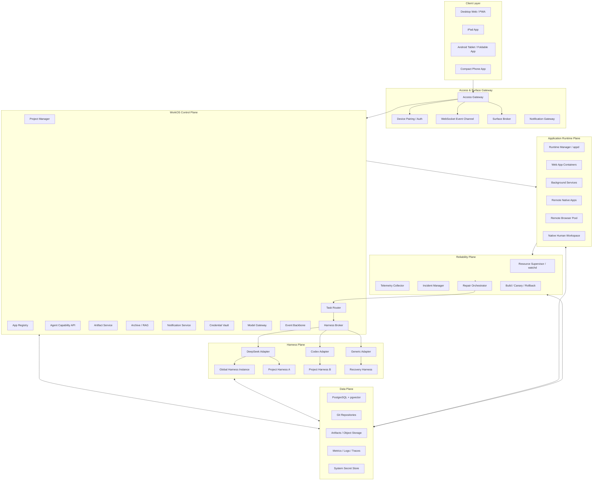
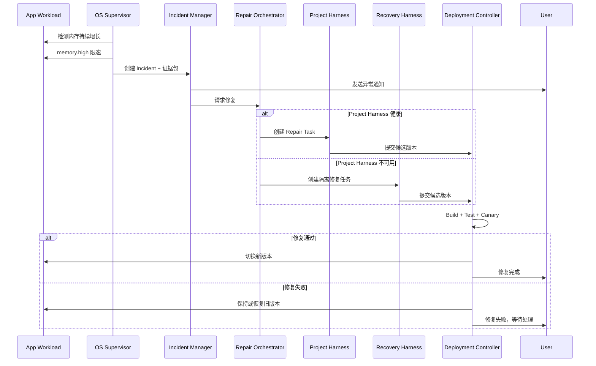

# Agent WorkOS 完整架构方案 v0.2

## 0. 核心定位

这套系统不是：

> Linux + DeepSeek Harness + 一个聊天网页。

也不是：

> 把 NAS 的应用图标换成 Agent 图标。

它应该被定义为：

> **一个运行在 Linux 之上的个人工作操作环境。人、Agent 和长期运行的个人软件围绕 Project 共同工作；所有应用都能在统一桌面中直接渲染，并通过桌面 Web、iPad、Android 平板和折叠屏访问。**

最核心的四个稳定抽象是：

```text
Project      工作上下文
Harness      Agent 运行能力
App          可持续运行的软件能力
Surface      App 在某个设备上的交互界面
```

此外还有两个系统级对象：

```text
Workload     一个实际运行的程序、任务或 Harness 实例
Incident     Workload 出现异常后形成的系统事件
```

---

# 1. 关键架构修正

## 1.1 DeepSeek Harness 只是第一个 Harness Adapter

不能在系统核心代码中写死：

```text
WorkOS Core
    ↓
DeepSeek Harness
```

正确关系应该是：

```text
WorkOS Core
    ↓
Harness Broker
    ├── DeepSeek Harness Adapter
    ├── Codex Harness Adapter
    ├── Generic CLI Adapter
    ├── MCP Agent Adapter
    └── Future Harness Adapter
```

DeepSeek Harness 适合作为第一个实现，因为它的模型、工具、Session、Agent Loop 和存储本身都是插件化的；但它仍处于快速迭代阶段，官方也明确提示会发生兼容性破坏，因此不能让 Project、App 和前端直接依赖它的内部数据结构。

Codex 也已经提供适合深度集成的 App Server，覆盖认证、会话历史、审批和流式 Agent 事件，并可以通过 SDK/JSON-RPC 控制。因此 Codex Adapter 完全可以遵循同一套 WorkOS Harness 接口。

---

## 1.2 Harness 拓扑是“一个全局 + 项目可选一个”

不是所有 Project 强制创建 Harness。

系统默认存在：

```text
Global Harness
```

每个 Project 可以选择绑定：

```text
Project Harness
```

因此可能出现：

```text
Global Harness                  DeepSeek Harness
D2B2 Project Harness            Codex Harness
Fairness Project Harness        DeepSeek Harness
Job Search Project              不创建 Project Harness
Temporary Project               使用 Global Harness
```

Project Harness 是“逻辑上的一个主要 Harness”，其中可以包含多个 Session、角色或子 Agent，例如：

```text
Project Harness
├── General Session
├── Coding Session
├── Research Session
├── Experiment Session
└── Repair Session
```

没有必要把每一个 Agent 角色都启动成一个完整 Harness 进程。

---

## 1.3 App 不直接访问模型 API，也不直接连接 Harness 内部接口

自定义 App 使用：

```text
WorkOS Agent API
```

而不是：

```text
OPENAI_API_KEY
DEEPSEEK_API_KEY
ANTHROPIC_API_KEY
```

也不是：

```text
直接请求 DeepSeek Harness 私有端口
```

正确路径为：

```text
Custom App
    ↓
App Capability Token
    ↓
WorkOS Agent API
    ↓
Harness Broker
    ↓
当前 Project Harness / Global Harness
    ↓
Model Gateway / Provider Credential
```

这样：

* API Key 只在系统中配置一次；
* App 永远看不到真实 Key；
* 每个 App 可以设置调用权限和预算；
* 用户可以更换 Harness 或模型；
* 可以统计每个 App、Project 和 Harness 的 Token 消耗；
* 可以在异常调用时直接切断 AI Capability。

---

## 1.4 资源保护不能依赖大模型

“程序 CPU 或内存异常以后，通知 Global Harness，再通知 Project Harness 修复”这个思路有一部分是正确的，但不应让 Global Harness 成为安全链路中的必经节点。

更可靠的关系是：

```text
OS Supervisor 负责检测和保护
Repair Orchestrator 负责选择谁来修复
Project Harness 负责理解代码并生成修复
Global Harness 负责协调、解释和兜底
```

即：

> **确定性的系统负责制止故障，Agent 负责理解和修复故障。**

即使模型服务断网、Global Harness 崩溃或 Project Harness 自己出现问题，OS 仍然必须能够限制 CPU、限制内存、停止进程、回滚版本。

---

## 1.5 UI 不再使用永久分栏

桌面 Web 不采用：

```text
Project Rail | App Rail | Stage | Agent Sidebar
```

这种固定分栏会长期占用空间，尤其不适合写代码、看 PDF、看图表和运行自定义 App。

正确方向是：

> **NAS/macOS 风格的完整桌面 + 内部窗口管理器 + Dock + Project Spaces。**

默认界面不显示永久侧栏。

Project、App 和 Agent 通过以下入口访问：

* 顶部极简系统栏；
* 底部 Dock；
* Project Mission Control；
* Agent Center App；
* Command Palette；
* 当前 App 的 Ask Agent 按钮；
* 通知和任务卡片。

---

# 2. 总体系统架构



---

# 3. 分层设计

## 3.1 Linux Foundation

底层继续采用标准 Linux，不重新开发 Kernel。

Linux 层负责：

```text
systemd
cgroup v2
filesystem
network namespace
container runtime
GPU device
process isolation
local users
Unix socket
```

Linux 只提供可靠执行环境。

WorkOS 的主要创新位于 Linux 用户空间：

```text
Project
Harness
App Runtime
Surface
Artifact
Notification
Knowledge
AI Capability
Program Supervision
```

---

## 3.2 WorkOS Control Plane

Control Plane 不执行用户代码，主要保存和协调状态。

核心模块：

| 模块                   | 职责                           |
| -------------------- | ---------------------------- |
| Project Manager      | Project、Workspace、Harness 绑定 |
| Harness Broker       | 统一管理不同厂商 Harness             |
| Agent API            | 为 App 和前端提供统一 Agent 调用       |
| App Registry         | App manifest、版本和安装状态         |
| Artifact Service     | Markdown、Diff、图表、结果和 App     |
| Surface Broker       | 为不同设备创建 App Surface          |
| Runtime Manager      | 启动、停止和升级 Workload            |
| Notification Service | 完成、异常和确认通知                   |
| Archive/RAG          | 自动归档历史并供 Agent 检索            |
| Credential Vault     | 系统统一管理模型和外部服务凭据              |
| Event Backbone       | 模块之间的状态与事件传播                 |

第一版可以是模块化单体，不需要一开始拆成几十个微服务。

---

# 4. 核心数据模型

## 4.1 Project

```typescript
interface Project {
  id: string;
  name: string;
  icon?: string;

  workspaceRefs: WorkspaceRef[];
  harnessBinding?: HarnessBinding;

  installedApps: string[];
  defaultAgentRole?: string;

  knowledgeCollectionId: string;
  artifactCollectionId: string;

  createdAt: string;
  updatedAt: string;
}
```

Project 不等于 Folder。

一个 Project 可以挂载：

```text
本地 Git Repository
NAS 文件夹
远程服务器目录
只读 Dataset
论文目录
Artifact 目录
Markdown Notes
```

Agent 看到统一逻辑路径：

```text
/workspaces/<project-id>/
├── code/
├── notes/
├── papers/
├── data/
├── artifacts/
└── apps/
```

---

## 4.2 Harness Binding

```typescript
interface HarnessBinding {
  providerId: string;
  instancePolicy: "persistent" | "lazy" | "ephemeral";
  profileId?: string;
  credentialRef?: string;
  resourcePolicyId: string;
}
```

例如：

```json
{
  "providerId": "codex-app-server",
  "instancePolicy": "lazy",
  "profileId": "coding-project",
  "resourcePolicyId": "project-standard"
}
```

---

## 4.3 App

```typescript
interface WorkOSApp {
  id: string;
  name: string;
  version: string;

  scope: "system" | "user" | "project";
  runtime: RuntimeDescriptor;
  surfaces: SurfaceDescriptor[];

  permissions: CapabilityRequest[];
  aiPolicy?: AppAIPolicy;
  resourcePolicy: ResourcePolicy;
  healthPolicy: HealthPolicy;

  sourceRef?: GitRef;
  maintainer: MaintainerBinding;
}
```

---

## 4.4 Workload

每一个实际运行的东西都必须拥有 Workload Identity：

```typescript
interface WorkloadIdentity {
  workloadId: string;

  kind:
    | "app"
    | "background-service"
    | "harness"
    | "agent-task"
    | "remote-browser"
    | "native-surface";

  projectId?: string;
  appId?: string;
  harnessInstanceId?: string;

  version?: string;
  runtimeId: string;
  cgroupPath: string;

  ownerUserId: string;
  maintainerBinding?: MaintainerBinding;
}
```

这是 OS 能够回答：

> “到底哪个程序占用了 CPU？”

的基础。

---

# 5. Harness Abstraction Layer

## 5.1 Harness Provider Interface

WorkOS Core 只认识统一接口：

```typescript
interface HarnessProvider {
  readonly id: string;

  describe(): Promise<HarnessProviderInfo>;

  createInstance(
    spec: HarnessInstanceSpec
  ): Promise<HarnessInstanceRef>;

  attachInstance(
    ref: HarnessInstanceRef
  ): Promise<HarnessConnection>;

  stopInstance(instanceId: string): Promise<void>;

  inspectHealth(
    instanceId: string
  ): Promise<HarnessHealth>;
}
```

Harness Connection：

```typescript
interface HarnessConnection {
  createSession(
    spec: SessionSpec
  ): Promise<SessionRef>;

  run(
    request: AgentTaskRequest
  ): AsyncIterable<CanonicalHarnessEvent>;

  steer(
    runId: string,
    input: AgentInput
  ): Promise<void>;

  cancel(runId: string): Promise<void>;

  approve(
    approvalId: string,
    decision: ApprovalDecision
  ): Promise<void>;

  getCapabilities(): HarnessCapabilities;
}
```

---

## 5.2 Capability Negotiation

不同 Harness 的能力不完全一致，所以 Adapter 必须声明：

```typescript
interface HarnessCapabilities {
  streaming: boolean;
  persistentSessions: boolean;
  resume: boolean;
  steerDuringRun: boolean;
  approvals: boolean;

  toolRegistration: boolean;
  mcp: boolean;
  subagents: boolean;

  workspaceMount: boolean;
  structuredArtifacts: boolean;
  usageReporting: boolean;
}
```

前端和 App 不能假设所有 Harness 都支持相同能力。

例如：

* DeepSeek Adapter 可以映射 Cordis Session 和事件；
* Codex Adapter 可以映射 App Server 的 JSON-RPC 和 streamed events；
* Generic CLI Adapter 可能只支持运行、停止和读取 stdout；
* 不支持的功能由 Broker 降级处理。

---

## 5.3 Canonical Harness Event

所有厂商事件统一转换成：

```typescript
type CanonicalHarnessEvent =
  | RunStarted
  | AssistantDelta
  | AssistantMessage
  | ToolCallStarted
  | ToolCallCompleted
  | ApprovalRequired
  | ArtifactCreated
  | UsageRecorded
  | RunWaiting
  | RunCompleted
  | RunFailed;
```

同时保留一份：

```text
providerRawEvent
```

用于调试，但前端不依赖它。

---

# 6. Global Harness 与 Project Harness

## 6.1 Global Harness 的职责

Global Harness 负责：

```text
跨 Project 对话
创建和整理 Project
搜索全局知识
创建个人 App
系统状态解释
任务路由
帮助用户选择 Project Harness
在 Project Harness 不可用时提供兜底
```

但 Global Harness 不应该默认拥有：

```text
Root shell
所有项目写权限
直接修改系统配置
无限模型预算
```

Global Harness 通过 Capability Gateway 执行操作。

---

## 6.2 Project Harness 的职责

Project Harness 只看到：

```text
当前 Project 的 Workspace
当前 Project 的 RAG
当前 Project 的 App
当前 Project 的 Artifact
当前 Project 的任务和实验
```

它负责：

```text
项目讨论
代码修改
论文阅读
实验执行
项目内 App 开发
项目内故障修复
```

---

## 6.3 Harness 间通信

不要使用 DeepSeek 或 Codex 自己的“子 Agent 协议”作为系统级协议。

统一使用 WorkOS Task Envelope：

```typescript
interface AgentTaskRequest {
  targetScope:
    | { type: "global" }
    | { type: "project"; projectId: string };

  role?: string;
  goal: string;

  contextRefs?: ContextRef[];
  requestedCapabilities?: string[];

  outputContract?: {
    artifactTypes: string[];
  };

  budget?: {
    maxTokens?: number;
    maxCost?: number;
    maxRuntimeSeconds?: number;
  };

  parentTaskId?: string;
  incidentId?: string;
}
```

这样 Global Harness 可以把任务路由给 Codex Project Harness，而不需要理解 Codex 内部 Session 格式。

---

# 7. 自定义 App 如何使用 AI

## 7.1 App Agent API

App SDK 提供：

```typescript
workos.agent.run({
  scope: "project",
  role: "coding",
  task: "分析最近三次实验，并生成一张对比图",
  contextRefs: [
    { type: "artifact", id: "exp-101" },
    { type: "artifact", id: "exp-102" }
  ]
});
```

或者：

```typescript
workos.agent.chat({
  scope: "global",
  message: "帮我把这段文本整理成项目笔记"
});
```

App 得到：

```text
taskId
eventStream
artifactRefs
approvalRequests
```

不会得到底层 Provider API Key。

---

## 7.2 AI Routing

```text
App 属于 Project
    ↓
优先使用 Project Harness
    ↓
Project 没有 Harness
    ↓
使用 Global Harness 或临时 Harness
```

系统 App 可以明确指定：

```text
scope = global
```

用户也可以在 App 设置中选择：

```text
Follow Project
Use Global
Use Specific Harness Provider
No AI
```

---

## 7.3 Credential Vault

Credential Vault 保存：

```text
DeepSeek API
OpenAI/Codex Auth
Anthropic API
Local Model Endpoint
GitHub Token
External Search Credentials
```

Harness Adapter 只能通过短期 credential lease 使用它们。

App 永远不能读取真实值。

---

# 8. App Runtime

## 8.1 App 类型

| 类型                     | 执行方式                          | UI                          |
| ---------------------- | ----------------------------- | --------------------------- |
| System App             | Trusted WorkOS process        | React/Web module            |
| Personal Web App       | Rootless container            | iframe Web Surface          |
| Full-stack App         | Frontend + backend container  | iframe Web Surface          |
| Background Service     | Container/systemd scope       | System-generated control UI |
| Remote Native App      | Container/host native process | WebRTC Surface              |
| Remote Browser         | Chromium worker               | WebRTC/Browser Surface      |
| Human Native Workspace | Host native                   | Terminal/Web control page   |

---

## 8.2 App Manifest

```yaml
id: experiment-dashboard
name: Experiment Dashboard
version: 0.4.1
scope: project

runtime:
  type: container
  image: workos/python-web:1
  command: ["python", "server.py"]
  port: 8080

surfaces:
  - id: main
    renderer: web-service
    route: /
    adaptive: true

permissions:
  - project.artifacts.read
  - project.experiments.read
  - agent.project.invoke
  - notifications.create

ai:
  routing: project
  maxTokensPerDay: 200000

resources:
  cpuSoft: 1
  cpuHard: 2
  memoryExpectedMb: 256
  memoryHighMb: 768
  memoryMaxMb: 1024
  pidsMax: 128

health:
  httpPath: /health
  startupSeconds: 30
  restartLimit: 3

maintainer:
  type: project-harness
  sourceRef: apps/experiment-dashboard
  tests:
    - pytest
```

---

# 9. OS 级程序监督与自我修复

## 9.1 为什么需要独立 Supervisor

Agent 生成的软件可能出现：

```text
Memory leak
CPU busy loop
GPU 长时间占用
进程无限创建
磁盘持续写入
无限网络请求
AI Token 无限消耗
服务不断崩溃重启
```

Linux cgroup v2 可以针对 Workload 统计和限制 CPU、内存、进程和 I/O；PSI 还能提供 CPU、内存与 I/O 的压力信息。systemd 也可以直接为服务设置 MemoryMax 等资源控制。

所以每个 App、Harness 和长期任务都必须运行在独立 cgroup 中：

```text
/workos
├── system
├── harnesses
│   ├── global
│   ├── project-d2b2
│   └── project-fairness
└── projects
    ├── d2b2
    │   ├── apps
    │   └── tasks
    └── fairness
```

---

## 9.2 Reliability Plane

```text
watchd
    采集进程与 cgroup 指标

Telemetry Collector
    收集 metrics / logs / traces

Policy Engine
    判断是否违反 App Resource Policy

Safety Controller
    限速、暂停、重启、隔离

Incident Manager
    保存异常和证据

Repair Orchestrator
    选择 Project Harness / Recovery Harness

Deployment Controller
    Build、Test、Canary、Promote、Rollback
```

OpenTelemetry Collector 可以统一接收和处理日志、指标与追踪信息，适合作为 App、Harness 和系统服务的通用遥测入口。

---

## 9.3 故障处理顺序



---

## 9.4 Global Harness 不作为中转站

推荐路径：

```text
Supervisor
    ↓
Incident Manager
    ├── 直接通知用户
    └── Repair Orchestrator
            ↓
        Project Harness
```

Global Harness订阅 Incident 摘要，用于：

* 向用户解释发生了什么；
* 处理跨项目问题；
* Project Harness 不可用时提供协助；
* 统一展示系统健康状态。

但不是：

```text
Supervisor → Global Harness → Project Harness
```

因为这样会增加：

* 单点故障；
* 延迟；
* 不必要的模型调用；
* Global Harness 上下文污染；
* 安全链路对 AI 的依赖。

---

## 9.5 分级自动修复

| 级别 | 操作             | 是否需要 Agent |
| -- | -------------- | ---------- |
| L0 | 限速、暂停、停止网络     | 否          |
| L1 | 重启、回滚已知稳定版本    | 否          |
| L2 | 收集日志、生成诊断      | 可选         |
| L3 | Agent 修改代码并测试  | 是          |
| L4 | 部署通过测试的候选版本    | 根据策略       |
| L5 | 数据迁移、权限提升、凭据修改 | 必须人工确认     |

---

## 9.6 AI 调用异常也属于 Workload 异常

AI Broker 需要按以下维度计费和限流：

```text
appId
projectId
harnessInstanceId
taskId
userId
model
```

异常示例：

```text
一分钟内调用模型 300 次
一个 Dashboard 一天消耗 300 万 Token
两个 Agent 互相反复调用
修复 Agent 无限重新生成同一版本
```

AI Broker 可以：

```text
warn
throttle
pause
circuit break
require approval
```

---

# 10. App Surface 与远程 UI 接口

## 10.1 App 不等于 UI

一个 App 可以包含：

```text
Backend Runtime
Background Worker
Desktop Surface
Tablet Surface
Phone Surface
Agent Interface
```

Surface Broker 根据设备选择合适的 Surface。

---

## 10.2 四类 Surface

### Web Bundle Surface

适用于纯前端 App：

```text
Static HTML / JS / CSS
```

由 WorkOS 托管。

### Web Service Surface

适用于有后端的 App：

```text
App Container :8080
    ↓
WorkOS Reverse Proxy
    ↓
iframe inside WorkOS Window
```

### Declarative Surface

App 返回结构化 UI：

```text
Table
Form
Chart
Markdown
Button
Progress
Artifact Viewer
```

由 WorkOS 原生渲染，适合简单后台工具。

### Remote Native Surface

适用于无法 Web 化的软件：

```text
Native Linux App
    ↓
Virtual Wayland Display
    ↓
Video Encoder
    ↓
WebRTC
    ↓
WorkOS Window
```

输入、剪贴板和窗口尺寸通过 WebRTC Data Channel 返回。

WebRTC 同时提供实时媒体和通用数据通道，适合将远程图形画面和输入事件组合到一个 Surface Session 中。

---

## 10.3 Surface 创建接口

```http
POST /v1/surfaces
```

```json
{
  "appInstanceId": "appinst-123",
  "projectId": "project-d2b2",
  "deviceProfile": "desktop-expanded",
  "viewport": {
    "width": 1460,
    "height": 900,
    "pixelRatio": 2
  },
  "preferredRenderer": "auto"
}
```

返回：

```json
{
  "surfaceSessionId": "surface-456",
  "renderer": "web-service",
  "url": "/surfaces/surface-456/",
  "bridgeToken": "short-lived-token",
  "capabilities": {
    "resize": true,
    "clipboard": true,
    "filePicker": true,
    "maximize": true
  }
}
```

Remote Native Surface 则返回：

```text
WebRTC offer
ICE configuration
Data channel schema
```

---

## 10.4 Surface Lifecycle

```text
create
attach
ready
resize
background
suspend
resume
detach
close
```

Project 切换后不一定销毁 App。

系统可以：

```text
保留后台运行
冻结前端 Surface
保存 UI checkpoint
返回 Project 时恢复
```

---

## 10.5 App Bridge

iframe App 通过 MessageChannel 使用系统能力：

```typescript
interface WorkOSAppBridge {
  window: {
    setTitle(title: string): void;
    setBadge(count?: number): void;
    maximize(): void;
    minimize(): void;
    close(): void;
  };

  project: {
    current(): Promise<ProjectSummary>;
  };

  files: {
    read(ref: FileRef): Promise<ArrayBuffer>;
    write(ref: FileRef, data: ArrayBuffer): Promise<void>;
    pick(options: FilePickerOptions): Promise<FileRef[]>;
  };

  artifacts: {
    open(id: string): Promise<void>;
    create(input: CreateArtifactInput): Promise<string>;
  };

  agent: {
    run(input: AgentTaskRequest): Promise<TaskRef>;
    stream(taskId: string): AsyncIterable<AgentEvent>;
  };

  notifications: {
    create(input: NotificationInput): Promise<void>;
  };

  theme: {
    get(): Promise<ThemeInfo>;
  };
}
```

所有调用都经过：

```text
App Identity
→ Capability Check
→ Project Scope Check
→ Audit
→ Execute
```

---

# 11. Desktop Web UI

## 11.1 不使用永久分栏

桌面默认结构：

```text
┌───────────────────────────────────────────────────────────────┐
│  WorkOS   D2B2 Project ▾      Experiment Dashboard    ●  🔔 │
├───────────────────────────────────────────────────────────────┤
│                                                               │
│        ┌──────────────────────────────┐                       │
│        │ Experiment Dashboard         │                       │
│        │                              │   ┌────────────────┐  │
│        │                              │   │ Agent Center   │  │
│        │                              │   │                │  │
│        └──────────────────────────────┘   └────────────────┘  │
│                                                               │
│                                                               │
│                  ┌────────────────────────┐                   │
│                  │ Agent Browser Files ...│  Dock             │
│                  └────────────────────────┘                   │
└───────────────────────────────────────────────────────────────┘
```

只有：

```text
极简顶部系统栏
完整桌面画布
底部 Dock
内部 App Window
```

没有永久 Project Sidebar、App Sidebar 和 Agent Sidebar。

---

## 11.2 Project 作为 Space

每个 Project 是一个独立 Space：

```text
Global Space
D2B2 Space
Low-rank GW Space
Fairness Space
Job Search Space
```

每个 Space 保存：

```text
打开的 App
窗口大小和位置
当前文档
当前 Harness Session
后台任务
Dock 固定 App
```

切换 Project 类似切换 macOS Desktop Space。

---

## 11.3 Project Mission Control

点击顶部 Project 名称或执行手势后：

```text
┌─────────────────────────────────────────────────────────────┐
│                         Projects                            │
│                                                             │
│ ┌────────────────┐ ┌────────────────┐ ┌────────────────┐   │
│ │ Global         │ │ D2B2           │ │ Fairness       │   │
│ │ Global Agent   │ │ 2 Tasks Running│ │ Review Ready   │   │
│ │ 3 Notifications│ │ 1 App Warning  │ │                │   │
│ └────────────────┘ └────────────────┘ └────────────────┘   │
│                                                             │
│ ┌────────────────┐ ┌────────────────┐                       │
│ │ Low-rank GW    │ │ + New Project  │                       │
│ │ Agent Idle     │ │                │                       │
│ └────────────────┘ └────────────────┘                       │
└─────────────────────────────────────────────────────────────┘
```

这样切换 Project，不需要常驻左侧栏。

---

## 11.4 Dock

Dock 默认包含：

```text
Home
Agent Center
Browser
Files
Docs
Code
Terminal
Experiments
Knowledge
App Library
System Monitor
```

右侧显示：

```text
当前 Project 自定义 App
最近使用 App
正在运行 App
```

---

## 11.5 Agent 入口

Agent 有五个入口，但都不永久占用屏幕。

### Agent Center App

用于完整管理：

```text
Global Harness
Current Project Harness
Sessions
Tasks
Approvals
Artifacts
Usage
```

### 顶部 Agent Status

显示：

```text
● Project Agent Running
○ Global Agent Idle
```

点击展开轻量菜单。

### Command Palette

```text
⌘K
```

输入：

```text
Ask current project agent
Ask global agent
Run task with Codex
Open recent artifact
```

### App 内 Ask Agent

Browser、Code、PDF、Experiment 等 App 可以调用：

```text
Ask Project Agent
Send selection to Agent
Explain current page
Fix current error
```

### Agent Floating Window

用户可以把 Agent Center 缩小为普通浮动窗口，或临时吸附到屏幕右侧，但它不是永久分栏。

---

## 11.6 Window Manager

内部 Window 支持：

```text
open
move
resize
minimize
maximize
close
snap left
snap right
fullscreen
```

最大化时：

```text
App Window
    ↓
占据整个 WorkOS Desktop Canvas
```

不会打开新浏览器标签页。

App 内的 `_blank` 请求默认被 Shell 拦截：

```text
内部 App → 新 WorkOS Window
外部网页 → Browser App Window
系统外打开 → 用户明确选择后才允许
```

---

# 12. iPad、Android 平板和折叠屏

## 12.1 技术选择

第一版建议：

```text
React + TypeScript Shared Shell
Desktop Web / PWA
Capacitor iPad Wrapper
Capacitor Android Wrapper
```

共享：

```text
Window Manager
Project State
App Bridge
Surface Host
Artifact Viewer
Agent Center
```

原生 Wrapper 提供：

```text
Push Notification
Device Pairing
File Share
Keyboard
Stylus
Safe Area
Android Fold/Hinge Information
Local Credential Storage
```

---

## 12.2 不同屏幕不是简单缩放

Android 官方的大屏与折叠屏指南强调，Adaptive App 应根据窗口大小和设备姿态替换布局组件，而不是简单拉伸；展开状态可以使用双面板，折叠状态则回到单面板。

因此定义四种设备模式：

```text
Compact
Medium
Expanded
Fold-separated
```

---

## 12.3 Compact Phone

```text
单 App 全屏
底部轻量导航
Project 切换使用 Sheet
Agent 使用全屏或 Bottom Sheet
通知直接进入 Artifact / Diff / Approval
```

主要用途：

```text
看状态
看结果
看 Markdown
看 Diff
批准或拒绝
给 Agent 下一条指令
```

---

## 12.4 iPad / Tablet

默认：

```text
一个 App 全屏
Dock 自动隐藏
Project Switcher 通过手势呼出
Agent 作为 Slide-over Window
```

需要时：

```text
App + Agent
PDF + Notes
Code Diff + Agent
Experiment + Report
```

双窗口是用户主动选择，不是系统永久分栏。

---

## 12.5 Unfolded Foldable

展开后可以显示：

```text
┌──────────────────────┬──────────────────────┐
│ Main App             │ Secondary App        │
│ Experiment           │ Agent / Markdown     │
│                      │                      │
└──────────────────────┴──────────────────────┘
```

折叠轴可以作为自然分隔线。

也可以保持：

```text
一个 App 全屏
```

系统不强制双栏。

---

## 12.6 UI 状态按设备类别保存

桌面窗口尺寸不能直接同步到手机。

因此保存：

```typescript
interface DeviceLayoutState {
  projectId: string;
  deviceClass: "desktop" | "tablet" | "foldable" | "phone";

  activeAppId?: string;
  windows: WindowPlacement[];
  recentApps: string[];
  dockApps: string[];
}
```

同步的是：

```text
当前 Project
当前 App
当前文档
当前 Agent Session
当前 Artifact
```

而不是精确窗口像素。

---

# 13. 局域网连接与远程接口

## 13.1 LAN 第一阶段

Linux 主机提供：

```text
https://workos.local
```

连接流程：

```text
Server 通过 mDNS 广播
    ↓
iPad/Android App 发现 WorkOS
    ↓
扫描桌面二维码
    ↓
校验服务器证书指纹
    ↓
交换设备公钥
    ↓
生成 Device Session
```

局域网内所有连接都使用 TLS。

客户端通过：

```text
HTTPS
WebSocket
WebRTC
```

访问系统。

---

## 13.2 统一 Access Gateway

不能把每个 App 的端口直接暴露到局域网。

所有访问经过：

```text
Access Gateway
```

负责：

```text
用户和设备认证
Project 权限
App Surface Token
Harness Event Stream
Reverse Proxy
WebRTC Signaling
Rate Limit
Audit
```

---

## 13.3 未来远程访问接口

底层定义 Transport Provider：

```typescript
interface TransportProvider {
  id: string;
  connect(device: DeviceIdentity): Promise<TransportSession>;
}
```

实现可以包括：

```text
LanDirectTransport
OverlayNetworkTransport
RelayTransport
```

这样未来可以增加：

```text
VPN
Tailscale 类网络
自建 Relay
公网 Gateway
```

而不需要修改 App、Harness 或 Surface 接口。

---

## 13.4 局域网通知的现实限制

App 在前台时，可以通过 WebSocket 实时接收事件。

但 iPadOS App 进入后台后通常会被挂起；可靠的远程通知需要通过 APNs。Apple 的官方通知架构要求服务器向 APNs 发送请求，再由 APNs 投递到设备。

因此第一版需要明确选择：

### 完全局域网模式

```text
App 打开时实时通知
App 再次打开时同步未读通知
后台通知不保证即时
```

### 可选 Push Relay 模式

```text
WorkOS Server
    ↓
仅发送加密的 notificationId
    ↓
APNs / FCM
    ↓
设备收到后回局域网读取真实内容
```

Relay 不保存：

```text
代码
项目名称
文档内容
Agent 输出
```

只传递最小的唤醒信息。

---

# 14. 底层服务部署

第一版单 Linux 主机建议运行：

```text
workos-gateway
workos-core
harness-host
runtime-manager
surface-broker
resource-supervisor
indexer
notification-service
otel-collector
postgres
```

物理上可以合并为较少进程：

```text
workos-core
    Project / App / Artifact / Agent API / Notification

harness-host
    Harness Broker + Adapters

runtime-host
    Runtime Manager + Surface Broker

reliability-host
    Supervisor + Incident + Repair

indexer
    Archive + RAG
```

不建议第一版使用 Kubernetes。

建议：

```text
systemd 管理可信系统服务
rootless Podman/Container 管理自定义 App
cgroup v2 管理所有 Workload
```

---

# 15. 数据存储

| 数据                           | 存储                          |
| ---------------------------- | --------------------------- |
| Project/App/Harness metadata | PostgreSQL                  |
| RAG embedding                | pgvector                    |
| App 和代码版本                    | Git                         |
| Markdown/PDF/图表/结果           | Object Store 或文件系统          |
| Session 原始事件                 | Append-only Event Store     |
| 系统事件                         | PostgreSQL Outbox/Event Log |
| Logs/Metrics/Traces          | Telemetry Store             |
| API Credential               | System Secret Store         |
| UI Layout                    | PostgreSQL / Device State   |

---

# 16. 推荐代码结构

```text
workos/
├── apps/
│   ├── desktop-web/
│   ├── mobile-shell/
│   └── admin-cli/
│
├── core/
│   ├── project/
│   ├── app-registry/
│   ├── artifact/
│   ├── notification/
│   ├── credentials/
│   └── event-backbone/
│
├── agent/
│   ├── harness-broker/
│   ├── agent-api/
│   ├── task-router/
│   └── adapters/
│       ├── deepseek/
│       ├── codex/
│       └── generic-cli/
│
├── runtime/
│   ├── appd/
│   ├── container-runner/
│   ├── native-runner/
│   ├── browser-runner/
│   └── surface-broker/
│
├── reliability/
│   ├── watchd/
│   ├── incident-manager/
│   ├── repair-orchestrator/
│   └── deployment-controller/
│
├── sdk/
│   ├── app-sdk/
│   ├── surface-sdk/
│   ├── agent-sdk/
│   └── protocol/
│
├── clients/
│   ├── ui-kit/
│   ├── window-manager/
│   ├── app-host/
│   ├── agent-center/
│   └── artifact-viewer/
│
└── deploy/
    ├── systemd/
    ├── containers/
    └── local-network/
```

---

# 17. 四个必须优先稳定的协议

这个系统真正不能轻易修改的，不是 DeepSeek Harness 或某个前端框架，而是下面四个接口。

## Harness Provider Protocol

定义：

```text
如何启动 Harness
如何创建 Session
如何运行任务
如何接收事件
如何审批和停止
```

## Agent Task Protocol

定义：

```text
App、Global Harness 和 Project Harness 如何委托工作
```

## App Surface Protocol

定义：

```text
一个 App 如何在 Desktop、iPad、Foldable 和 Phone 中渲染
```

## Workload Incident Protocol

定义：

```text
OS 如何描述故障
如何提供证据
如何请求 Agent 修复
如何部署和回滚
```

只要这四个协议保持稳定：

* DeepSeek 可以替换成 Codex；
* React 可以替换成其他客户端；
* Docker 可以替换成 microVM；
* LAN 可以扩展到远程访问；
* Global Harness 和 Project Harness 可以采用不同厂商；
* 自定义 App 不需要重新接入 AI。

---

# 18. 第一版产品边界

第一版应当优先完成：

```text
1. Project Space
2. Desktop Window Manager
3. Dock / Launchpad / Project Mission Control
4. Global Harness + Optional Project Harness
5. DeepSeek Harness Adapter
6. Harness Provider Interface
7. Custom Web App Surface
8. App Agent API
9. Central Credential Vault
10. Workload Identity + cgroup Monitoring
11. Resource Alert + Restart + Rollback
12. iPad/Android Adaptive Shell
13. LAN Pairing
14. Artifact / Diff / Markdown Review
```

第一版可以暂时不完成：

```text
复杂知识图谱
多人协作
公网访问
完整 Native App Streaming
完全自动语义修复
多个 Harness 同时协作一个 Project
复杂自由窗口动画
```

---

# 19. 最终架构关系

```text
Linux
    提供进程、文件、网络、GPU 和隔离

WorkOS Core
    提供 Project、App、Artifact、权限和通知

Harness Broker
    将 DeepSeek、Codex 等 Harness 统一起来

Global Harness
    管理全局工作、系统解释和跨项目协调

Project Harness
    理解具体项目并执行项目任务

Agent API
    让所有自定义 App 安全地使用 Harness

Runtime Manager
    运行 App、服务、浏览器和 Native 程序

Surface Broker
    把 App 渲染到 Desktop Web、iPad 和折叠屏

OS Supervisor
    确定性地监控、限制和隔离异常程序

Repair Orchestrator
    将故障交给正确的 Project Harness 修复

Desktop Shell
    用 NAS/macOS 风格统一承载所有 App
```

这套系统最关键的设计原则可以压缩成六句话：

> **DeepSeek 是 Adapter，不是系统核心。**

> **全局有一个 Harness，每个 Project 可以选择自己的 Harness。**

> **App 使用 WorkOS Agent API，而不是持有 API Key。**

> **OS 负责检测和制止异常，Agent 负责诊断和修复。**

> **所有 App 都通过 Surface 在同一个桌面窗口中渲染，不打开新标签页。**

> **桌面使用完整画布、窗口、Dock 和 Project Spaces，而不是永久分栏。**
